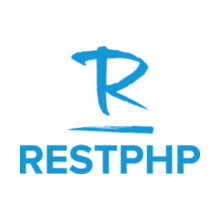

RESTPHP is an extremely simple and easy to understand skeleton PHP application, reduced to the max.
It is not a framework but rather a boilerplate to begin your Restfull Application.
If you just want to show some pages, do a few database calls and a little-bit of AJAX here and there, without
reading in massive documentations of highly complex professional frameworks.

## Getting Started

First Thing to do is clone the Repository or download the project zip file on your system. 
Afterwords you must move it to your current Apache or Xampp public Folder. 

### Prerequisites

RestPhp requires "mod_rewrite" rule enaled in your web server instance.

NOTE: If you already have "mod_rewrite" enabled you may jump to the next section

If This is not alredy enabled you must:
In Xampp: Go to your "xampp\apache\conf" find the line with the following
   
```
#LoadModule rewrite_module modules/mod_rewrite.so
```
    
And Remove the comment as shown
    
```
LoadModule rewrite_module modules/mod_rewrite.so
```
    
The Same procedure is valid for native apache installations where the config file will be "httpd.conf" in your apache
installation folder.

Remeber always to restart Xampp or Apache when modifying configurations.

### Installing

There is no major installation required except for the Database to be setup and functional

* Step 1 Database Setup

  Open PhpmyAdmin or whatever Database manager you have on your system and create a new Database with any name you wish
  
  Open the newely created database and import the Database Schema given in the cloned repository "RestPhpDB.sql".
  
  This is the database structure corresponding to the "boilerplate model" already implemented on the Server     (Devices,Brands,Categories,Review)
  
* Step 2 App Configuration

   Now you must open the project in your favorite IDE
   
   Open the "config.php" file in the "application/config/" folder and setup the configuration for your Database
   ```
   define('DB_TYPE', 'mysql');
   define('DB_HOST', '127.0.0.1');
   define('DB_NAME', '[your database name]');
   define('DB_USER', '[your db user name]');
   define('DB_PASS', '[your db password]');
   define('DB_CHARSET', 'utf8');
   ```
     
* Enable or Disable API KEY Authentication
  
  DISABLED BY DEFAULT
  To Endable API KEY Authentcation set the following Variable to "true"
  
  ```
   define('AUTHENTICATION_ENABLED',false);
   ```

  This is just a simple elementary method of denying access to those that do not have a proper API KEY
  
  The key Default is at "12345" 
    ```
  define('API_KEY',"12345";)
   ```
  
  The Authorization key must be sent through the "Authentication Header"


## API Usage

For Each Element in the Domain Model it is possible to GET or POST

GET AND POST are triggered to the same URL. 

The Server will pick up either the requst is a GET or POST and redirect to the specific Controller

All the responses are JSON Parsed

Example for Devices

* A Get Request to the url
   ```
   "[restphpserver]/devices" 
   ```
   will return all the devices
   
* A Get Request to the url
   ```
   "[restphpserver]/devices/{id}" 
   ```
   will return the device with the given id. 
    
    ```
   "[restphpserver]/devices/1" 
   ```
   will return the device with id=1.
   
   Response Example
   
      ```
      {
      "id": "2",
      "model": "Iphone 7",
      "price": "800",
      "imageurl": "img/devices/device_2.png",
      "categoryid": "2",
      "categoryname": "Phone",
      "brandid": "1",
      "brandname": "Apple",
      "reviews": [
            {
            "deviceid": "2",
            "title": "Iphone",
            "description": "Same Old Iphone ",
            "vote": "2",
            "userid": "1"
            },
            {
            "deviceid": "2",
            "title": "New Iphone",
            "description": "As usual nothing new",
            "vote": "1",
            "userid": "5"
            }
      ]}
   ```
* A POST Request to the url
   ```
   "[restphpserver]/devices" 
   ```
   with the specific data will store a new device with such data in the Database
   
   Data must be sent as "Form Data" and "keys" must be the same as the $fillable array in the specific Model.
   
   The $fillable array in each model is a protection to SQL Injection. 
   
   EXAMPLE of the $fillable array of Model Devices
   
   ```
   protected $fillable=["categoryid","brandid","model","price","imageurl"];
   ```
      
   Example of Ajax in POST Request to "[restphpserver]/devices" 
     ```
   $.post( "[restphpserver]/devices", 
   { categoryid: 1, 
     brandid: 2, 
     model:"Galaxy S5", 
     price:250,
     imageurl:"[imageurl]"}
    ).done(function( data ) {
       alert( "Data Loaded: " + data );
     });
   ```
   Remember!! You can only write values that are in the "$fillable" array of each model!!!!
   
   FILLABLES OF DEVICES
   
   ```
   protected $fillable=["categoryid","brandid","model","price","imageurl"];
   ```
   
   FILLABLES OF REVIEWS
   
   ```
    protected $fillable=["title","deviceid","description","vote","userid"];
   ```
   
   If everything goes well, the POST Requst will return a JSON Saying "DEVICE ADDED"
   
  
   
 * A Get Request to the url  A SPECIAL CASE!!!
   ```
   "[restphpserver]/categories" 
   ```
   will not return a list of all the categories, but a JSON Formatted Object as Following. 
   This Structure was Made to be compatible with the FrontEnd project https://github.com/FabioDiSabatino/appCorso
   
   Json Response Example
    ```
   {
      "categoryid": "1",
      "categoryname": "Tv",
      "brands": [
            {
            "brandid": "2",
            "brandname": "Samsung",
            "devices": [
                  {
                  "id": "3",
                  "model": "Smart TV Samsung 7300",
                  "price": "2300",
                  "imageurl": null,
                  "categoryid": "1",
                  "categoryname": "Tv",
                  "brandid": "2",
                  "brandname": "Samsung",
                  "reviews": []
                  },
                  {
                  "id": "4",
                  "model": "Apple Tv",
                  "price": "340",
                  "imageurl": null,
                  "categoryid": "1",
                  "categoryname": "Tv",
                  "brandid": "2",
                  "brandname": "Samsung",
                  "reviews": []
                  }
                  ]
                  }
      ]},
   ```
   The Reviews are only to be seen by A GET Request the specific deviceid as seen before
   
        ```
         "[restphpserver]/devices/1" 
         ```
   
   The Same approach of GET and POST Requests is the same for every model of the Application
   

## Built With

* [Php 7.1](http://www.php.net/) - HyperText Preprocessor
* [Apache](https://maven.apache.org/) - Dependency Management
* [MySql](https://www.mysql.com) - The world's most popular open source database

## Authors

* **Anthony Daniel Torretti**

## License

OpenSource
## Acknowledgments

* Hat tip to anyone who's code was used
* Inspiration
* Time


